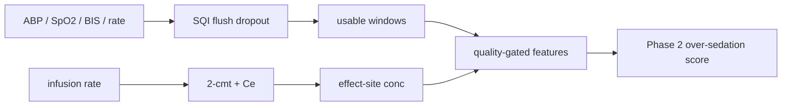

# or-signals

Waveform-first research on intraoperative awareness and over-sedation risk.
Artifact/SQI is a first-class module. Exposure is PK/PD effect-site
concentration, not raw infusion rate.

[](https://github.com/techiegoku2623/or-signals/actions/workflows/ci.yml)
[](pyproject.toml)
[](LICENSE)

## Status

| Phase | Deliverable | Status |
| --- | --- | --- |
| 0 | Research memo and harnesses | In review — docs/phase-0/research-memo.md |
| 1 | Architecture, schemas, data contracts | Not started |
| 2 | First vertical slice | Not started |
| 3 | Evaluation and demo | Not started |

Status values: Not started / In progress / In review / Merged.

## The problem this solves

OR monitors already show pressure, saturation, a pump rate, and a processed
EEG number. They do not join those streams into a quality-gated, effect-site
exposure with an honest label. An arterial flush looks like a crisis. A
bolus makes rate and brain concentration diverge. Awareness labels are so
rare that a model of awareness is usually a model of BIS.

This is research, not a clinical monitor and not a medical device.
Depth-index proxies are not awareness labels. Sample waveforms in this
repository are synthetic, not VitalDB excerpts (see `docs/DATA.md`). No
patient-identifiable data is used.

## Walkthrough

Phase 0 ships the designed excerpts and the measurements. `or-signals score`
is Phase 2.

### Step 1 — designed sample set

```bash
make setup && make demo
```

`make demo` prints the five committed cases. Actual stdout:

```
or-signals designed sample cases

clean.npz  clean
  path:     full signal coverage
  expected: SQI keeps almost all samples. Usable depth-index proxy is present.

artifact.npz  artifact
  path:     arterial-line flush and damping
  expected: SQI rejects the flush/damping window. Must not call the 42 mmHg plateau hypotension.

dropout.npz  dropout
  path:     long sensor dropout
  expected: Gaps are reported. Samples are never interpolated.

bolus.npz  bolus
  path:     bolus: infusion rate vs effect-site concentration
  expected: Raw infusion rate and Ce diverge after the bolus. Depth proxy tracks Ce, not rate.

no-label.npz  no-label
  path:     no usable depth label
  expected: Excluded from training. Reported as unlabeled.

Research tool only. Not a clinical monitor and not a medical device. Depth-index proxies are not awareness labels. This output is not clinical advice.
```

They are not the first five VitalDB cases. See `data/sample/README.md`.

Recordings `demo/01-score-bolus.cast` land in Phase 3.

### Step 2 — quality-gated clean case (Phase 2)

```bash
or-signals score --case data/sample/clean.npz
```

Reserved. Usable windows only. Never interpolate.

### Step 3 — flush is not hypotension (Phase 2)

```bash
or-signals score --case data/sample/artifact.npz
```

Reserved. The quality module must reject the square jump. Calling the
damped 42 mmHg plateau hypotension is a bug.

### Step 4 — unlabeled case, refused (Phase 2)

```bash
or-signals score --case data/sample/no-label.npz
```

Reserved. No usable depth label: exclude from training and say so.

### Step 5 — measured SQI, labels, and PK/PD

```bash
make eval
```

Runs now. Regenerates `docs/EVALUATION.md` from the three harnesses.

## Layout

1. `docs/phase-0/research-memo.md` — label pivot, SQI rules, PK/PD choice
2. `data/sample/README.md` — why each excerpt exists
3. `src/or_signals/sqi.py` — flush, damping, dropout; no interpolation
4. `src/or_signals/pkpd.py` — Schnider-style 2-compartment + effect site
5. `research/phase0/` — the measurements
6. `src/or_signals/cli.py` — demo-plan only, until Phase 2

## Results

Regenerated by `make eval`. Baseline column is mandatory.

<!-- EVAL_TABLE_BEGIN -->

| Measurement | Result | Baseline |
| --- | --- | --- |
| Clean ABP usable fraction | 1.000 | treat all samples as usable |
| Artifact ABP usable fraction | 0.750 | treat flush as hypotension |
| Awareness labels (index) | 1/200 | assume labeled |
| Pivot to over-sedation | True | model awareness |
| corr(Ce, depth proxy) | 0.990 | corr(rate, proxy) -0.294 |

<!-- EVAL_TABLE_END -->

## 🏗️ Architecture & Event Topology



`QualityReport.interpolated` is always false. Gaps are listed, not filled.

## ⚖️ Architecture Trade-offs & Pragmatic Decisions

| Chosen | Given up | What would change the answer |
| --- | --- | --- |
| Synthetic excerpts | VitalDB bytes in the demo | One license, plus a review that MIT redistribution is allowed (it is not confirmed today) |
| Pivot to over-sedation | Awareness classifier | A corpus with usable awareness labels above the §4.2 gate |
| 2-compartment Schnider + ke0 | Full 3-compartment Schnider | Bolus-peak error vs 3-cmt large enough to matter |
| numpy + JSON sidecar | `.vital` reader | Need for native VitalDB files |
| Rule SQI | Learned artifact model | Real-byte flush signatures the rules miss |

## 🛡️ Edge Cases & Failure Modes

- Arterial flush (square ~300 mmHg) then damped 42 mmHg: reject, do not call hypotension.
- Long NaN dropout: report the gap, never interpolate.
- Bolus: rate spikes and returns; Ce lags; depth proxy tracks Ce.
- `no-label`: no BIS, no awareness tag; excluded from training.
- BIS-like values are a Hill-of-Ce proxy, not recall of intraoperative awareness.
- Female LBM uses the James formula branch; Phase 0 samples use the male reference adult.

## Limitations

Not a monitor. Not a VitalDB redistributor. Not an awareness detector.
Phase 0 does not score live cases, does not read `.vital`, and does not
record asciinema. Arterial propofol concentrations are unmeasured. A live
VitalDB label audit is unmeasured.

## License and citation

MIT. Cite Schnider et al., Anesthesiology 1998;88:1170-1182 and 1999;90:1502-1516
for the PK/PD constants, Lee et al., Sci Data 2022;9:279 for VitalDB when
you use that corpus under its own terms, and this repository for the SQI
and research pipeline.
